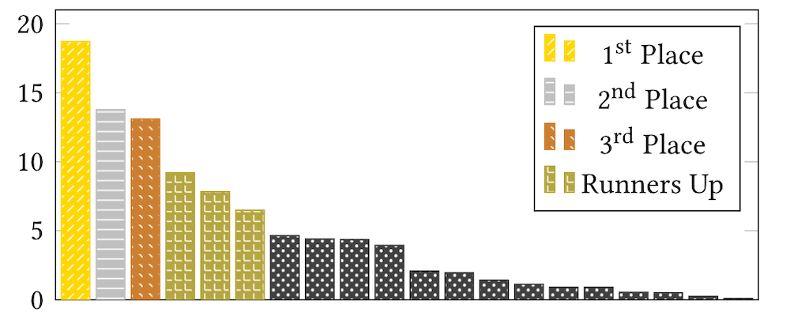
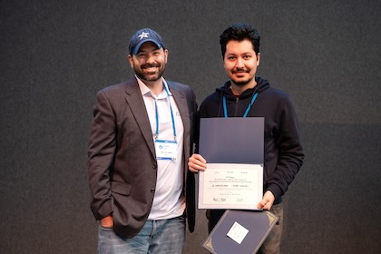
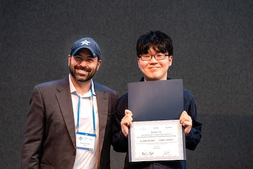
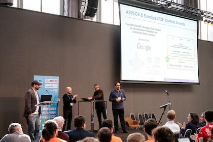
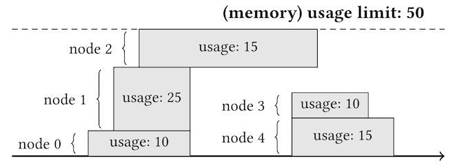

# The ASPLOS 2025 / EuroSys 2025 Contest on Intra-Operator Parallelism for Distributed Deep Learning

Teams from around the globe are invited to contribute submissions toward solving *intra-operator parallelism for distributed deep learning*, a combinatorial optimization problem that arises during the compilation of Machine Learning models onto the resources of multi-device hardware accelerators.  Prizes will be awarded to top-ranking teams who commit to open-sourcing their solver prior to the following year's conference.

<div align="center">

| Rank            |   Prize | Team                              | Source&nbsp;Code
| --------------: | ------: | --------------------------------- | :---------:
|  First&nbsp;Place&nbsp;🥇 | $25,000 | Christoph Staudt + Mark Blacher (*Friedrich Schiller University Jena*) | TBD
| Second&nbsp;Place&nbsp;🥈 | $10,000 | Aleksandr Morozov | TBD
|  Third&nbsp;Place&nbsp;🥉 |  $5,000 | Stephan Spengler + Samuel Grahn (*Uppsala University*) | TBD
|    Runner-Up&nbsp;⭐ |  $2,000 | Koki Aoyama (*Osaka University*) | [here](https://github.com/kotamanegi/iopddl-solution/tree/submitted_version)
|    Runner-Up&nbsp;⭐ |  $2,000 | Haodi Jiang + Yitian Yang + Ruwen Fan + Shiwei Gao + Shaoxun Zeng + Junrong Huang + Huajun Bai + Hao Guo + Youyou Lu (*Tsinghua University*) | TBD
|    Runner-Up&nbsp;⭐ |  $2,000 | Ava Ye | TBD

</div>

<!--
<p align="center">
<a href="https://forms.gle/oHf2K6vqPjBwaQWHA">

</a>
</p>
-->

## Coming Soon! Contest Retrospective

<div align="center">
<table>
<tr>
<td></td>
<td><pre>@inproceedings{IOPDDL2025,
  title = {The ASPLOS 2025 / EuroSys 2025 Contest
           on Intra-Operator Parallelism for
           Distributed Deep Learning},
  booktitle = {Proceedings of the 30th ACM International Conference
               on Architectural Support for Programming Languages
               and Operating Systems},
  volume = {3},
  author = {Moffitt, Michael D. and Fegade, Pratik},
  year = {2025},
  series = {ASPLOS 2025}
}</pre></td>
</tr>  
</table>  
</div>

## Distribution of Final Scores

<p align="center">

</p>

The full set of results can be found <a href="https://github.com/asplos-contest/2025/blob/main/misc/iopddl_final_results.csv">here</a>.

## Photos from the Award Ceremony

<p align="center">
<a href="misc/photos/award_ceremony_25.jpg"></a>
<a href="misc/photos/award_ceremony_24.jpg"></a>
<a href="misc/photos/award_ceremony_22.jpg"></a>
<a href="misc/photos/award_ceremony_23.jpg"></a>
</p>

## Important Dates

<div align="center">

| Date           | Event                                                                  |
| -------------- | ---------------------------------------------------------------------- |
| ~~2024-12-01~~ | Contest [Announced](https://www.sigarch.org/call-participation/the-asplos-2025-eurosys-2025-contest-track/)                                                      |
| ~~2024-12-02~~ | Contest [GitHub Repository](https://github.com/google/iopddl) (including [Benchmark Subset](https://github.com/google/iopddl/tree/main/benchmarks)) Released                  |
| ~~2025-02-03~~ | Application Deadline for [Student Travel Grants](https://www.asplos-conference.org/asplos2025/student-travel-grants/)                                 |
| ~~2025-02-15~~ | Contest [Registrations](https://forms.gle/oHf2K6vqPjBwaQWHA) & Preliminary Submissions Due<sup>*</sup>        |
| ~~2025-03-01~~ | Contest Final Submissions Due<sup>*</sup>                              |
| ~~2025-03-03~~ | [Early Registration Deadline for ASPLOS 2025 / EuroSys 2025](https://www.asplos-conference.org/asplos2025/registration/)             |
| ~~2025-03-15~~ | [Special Session Schedule](https://github.com/asplos-contest/2025/blob/main/misc/SCHEDULE.md) Finalized                                     |
| ~~2025-03-30~~ | Contest Special Session during [ASPLOS 2025 / EuroSys 2025 Workshops](https://www.asplos-conference.org/asplos2025/workshops-and-tutorials/)    |
| ~~2025-04-01~~ | Contest Winners Announced during ASPLOS 2025 / EuroSys 2025 Conference |

</div>

<sup>*</sup>Submissions are due by 11:59pm at any time on Earth.

## Problem Description

With machine learning models becoming larger and larger, multi-device execution across several slices or pods of hardware accelerators is imperative to meet latency and throughput requirements across training and serving workloads. When executing an ML computation in a distributed manner, a key determinant of performance is the way that computation is sharded across the multiple devices. An example of a 3D tensor sharded onto a 2D device mesh is shown below:

<p align="center">

</p>

Sharding a model to minimize exposed communication (e.g., using data parallelism or operator parallelism) can lead to significant performance gains.  Unfortunately, given that model computations regularly contain hundreds or thousands of tensors and HLO ops, manually specifying how each should be executed across multiple devices is usually not feasible.  Your challenge is to design an algorithm capable of efficiently and effectively performing this task.

As input, the algorithm will accept a graph (see: [example.json](https://github.com/google/iopddl/blob/main/example.json)) where nodes are associated with one or more *strategies*, and each strategy is annotated with a corresponding *node cost*.  In addition, certain pairs of nodes are connected by edges, and each pairwise strategy combination incurs a corresponding *edge cost*.  Solutions should select one strategy per node that minimizes total cost as much as possible.

<p align="center">

</p>

Finally, nodes also incur a strategy-specific memory *usage* over a fixed time interval.  The sum of usages at any given time point in a solution must not eclipse the *usage limit* for that benchmark.

<p align="center">

</p>

Broadly speaking, the structural characteristics of a benchmark's graph topology and memory profile tend to vary wildly as a function of model task (e.g., training vs. serving) and model modality (e.g., language vs. vision).

## Submission

Starting in mid-February, registered teams will be asked to submit a binary executable named `iopddl` that takes two arguments: a path to the input problem and a timeout duration in seconds:

```
$ ./iopddl example.json 10
```

The final line of the binary's output should be a comma-delimited list of node strategy indices enclosed in brackets (all intermediate lines will be ignored):

```
# Found solution [0, 0, 2, 0, 0] with cost 545  <--- this line ignored
# Found solution [0, 0, 2, 1, 0] with cost 445  <--- this line ignored
[0, 0, 2, 1, 0]
```

If no solution can be found, feel free to produce an empty list `[]`.  Finally, to ensure that the binaries can be executed properly, teams will have an opportunity to submit a preliminary version to the Contest Organizers (starting in early February) who will then test it on their machine.

## Getting Started

To help you get started, we have released a [separate GitHub repository](https://github.com/google/iopddl) containing several C++ files that define the basic problem and solution classes, along with various utilities.  You are under no obligation to use these source codes.

<div align="center">

| File        | Description                                                                                            |
| ----------- | ------------------------------------------------------------------------------------------------------ |
| [`iopddl.h`](https://github.com/google/iopddl/blob/main/iopddl.h)  | Defines the `Problem` and `Solution` classes, along with methods for file I/O and solution evaluation. |
| [`solver.cc`](https://github.com/google/iopddl/blob/main/solver.cc) | A simple random solver (**teams will want to replace this with their own implementation**).            |
| [`main.cc`](https://github.com/google/iopddl/blob/main/main.cc)   | Reads the given problem, calls the solver, and prints the solution to standard output.                 |

</div>

You should be able to issue the following commands to download the source codes, compile the project, and run the executable:

```
$ git clone --recursive https://github.com/google/iopddl.git
$ mkdir iopddl/build && cd iopddl/build && cmake .. && make
$ ./iopddl example.json 10
```

Please don't hesitate reaching out to the Contest Organizers if you encounter any trouble getting these materials to work.

## Benchmarks

The contest will involve twenty-five industrial benchmarks; [five have been released](https://github.com/google/iopddl/tree/main/benchmarks) in advance to contest participants (for testing purposes), and the remaining twenty will be withheld for evaluation:

<div align="center">

| Benchmark Name         | # Nodes | # Edges |     Timeout | Will be released to participants? |
| ---------------------- | ------: | ------: | ----------: | :-------------------------------: |
| `asplos-2025-iopddl-A` |  34,932 |  54,801 | 1 minute(s) |                               Yes |
| `asplos-2025-iopddl-B` |     TBD |     TBD | 1 minute(s) |                                   |
| `asplos-2025-iopddl-C` |     TBD |     TBD | 1 minute(s) |                                   |
| `asplos-2025-iopddl-D` |     TBD |     TBD | 1 minute(s) |                                   |
| `asplos-2025-iopddl-E` |     TBD |     TBD | 1 minute(s) |                                   |
| `asplos-2025-iopddl-F` |     TBD |     TBD | 2 minute(s) |                                   |
| `asplos-2025-iopddl-G` |     816 |   1,023 | 2 minute(s) |                               Yes |
| `asplos-2025-iopddl-H` |     TBD |     TBD | 2 minute(s) |                                   |
| `asplos-2025-iopddl-I` |     TBD |     TBD | 2 minute(s) |                                   |
| `asplos-2025-iopddl-J` |     TBD |     TBD | 2 minute(s) |                                   |
| `asplos-2025-iopddl-K` |     TBD |     TBD | 3 minute(s) |                                   |
| `asplos-2025-iopddl-L` |     TBD |     TBD | 3 minute(s) |                                   |
| `asplos-2025-iopddl-M` |  32,894 |  47,067 | 3 minute(s) |                               Yes |
| `asplos-2025-iopddl-N` |     TBD |     TBD | 3 minute(s) |                                   |
| `asplos-2025-iopddl-O` |     TBD |     TBD | 3 minute(s) |                                   |
| `asplos-2025-iopddl-P` |     TBD |     TBD | 4 minute(s) |                                   |
| `asplos-2025-iopddl-Q` |     TBD |     TBD | 4 minute(s) |                                   |
| `asplos-2025-iopddl-R` |     TBD |     TBD | 4 minute(s) |                                   |
| `asplos-2025-iopddl-S` |  28,526 |  38,826 | 4 minute(s) |                               Yes |
| `asplos-2025-iopddl-T` |     TBD |     TBD | 4 minute(s) |                                   |
| `asplos-2025-iopddl-U` |     TBD |     TBD | 5 minute(s) |                                   |
| `asplos-2025-iopddl-V` |     TBD |     TBD | 5 minute(s) |                                   |
| `asplos-2025-iopddl-W` |     TBD |     TBD | 5 minute(s) |                                   |
| `asplos-2025-iopddl-X` |     TBD |     TBD | 5 minute(s) |                                   |
| `asplos-2025-iopddl-Y` |  62,185 |  91,020 | 5 minute(s) |                               Yes *(usage limit updated on 2024-12-09)* |

</div>

All benchmarks will become publicly available after the contest is complete.

## Evaluation and Scoring

The contest organizers will execute each team's binary across the twenty withheld benchmarks on a dedicated 8-core Linux workstation with 32GB of RAM.  Rankings will be established by calculating the total number of points per team, where points are derived by normalizing cost values against the best submitted solution.

For example, assume the following raw costs:

<div align="center">

| Team               | Benchmark X   | Benchmark Y   | Benchmark Z   |
| ------------------ | ------------: | ------------: | ------------: |
| Team A             |   cost: 100   |   cost: 500   |   cost: 800   |
| Team B             |   cost: 300   |   cost: 200   |   cost: 900   |
| Team C             |   cost: 600   |   cost: 700   |   cost: 400   |
| **Min. Team Cost** | **cost: 100** | **cost: 200** | **cost: 400** |

</div>

The points that a team earns for a particular benchmark is then equal to *<sup>min_team_cost</sup> / <sub>team_cost</sub>*

<div align="center">

| Team     |  Benchmark X |  Benchmark Y |  Benchmark Z | **Total Points** | **Ranking**         |
| -------- | -----------: | -----------: | -----------: | ---------------: | --------------------:
| Team A   | 1.000 points | 0.400 points | 0.500 points | **1.900 points** |  **First Place 🥇** |
| Team B   | 0.333 points | 1.000 points | 0.444 points | **1.778 points** | **Second Place 🥈** |
| Team C   | 0.167 points | 0.286 points | 1.000 points | **1.452 points** |  **Third Place 🥉** |

</div>

## Presentations

Teams who successfully submit an entry will be invited to present a ~10 minute informal overview of their approach at a <a href="https://github.com/asplos-contest/2025/blob/main/misc/SCHEDULE.md">special session</a> held on March 30th during the [Workshop & Tutorial](https://www.asplos-conference.org/asplos2025/workshops-and-tutorials/) days.  Winners will be announced later in the week, with full results being released soon after the conference.

## Contest Eligibility

All are welcome to participate in the contest -- including teams from academia, industry, and elsewhere -- with the exception of the Contest Organizers and employees of the Contest Sponsor.  Individuals are prohibited from participating in multiple teams.  In order to be eligible for prizes, contestants must commit to releasing an open-source version of their implementation prior to **ASPLOS 2026** (allowing teams sufficient time to write & submit papers detailing their approach).

## Frequently Asked Questions

To raise a question, please create an issue in this repository, or feel free to reach out to the contest organizers directly.

***What flavors of parallelism are in scope?***

 * The strategies in our benchmarks include combinations of *data parallelism* and *operator parallelism* (i.e., for SPMD partitioning) but exclude *inter-operator parallelism* (i.e., for multi-stage pipelining) that would differentiate which operators of the graph are executed on specific devices.

***What level of precision will the values in the benchmarks have?***

 * All cost and memory usage values in the benchmarks can be represented as 64-bit integers, but beware of integer overflow when calculating total cost and/or total memory usage.

***How should usage intervals be interpreted?***

 * A node with usage interval `[lower, upper]` should be considered *half-open* with an *exclusive* upper bound. In other words, it will consume memory at time points {*lower, lower + 1, ..., upper − 1*}.  Hence, any nodes with an empty interval `[0, 0]` essentially consume no memory (but will still contribute node costs and possibly edge costs).

***Are all edge endpoints in the graph unique?***

 * Not necessarily; for a given pair of nodes `[pred, succ]`, there may be zero, one, or multiple edges that connect them.  For example, you'll find that in *Benchmark A*, there are two separate edges (#60 and #21438) that connect nodes #5 and #617.   The total cost between a pair of nodes would thus be the sum across all such edge costs.

***Can submissions employ third-party libraries?***

 * Third-party libraries should be just fine, as long as they don't require a commercial license.

***Will there be a real-time leaderboard to track submission scores for all teams?***

 * For this particular contest, such a feature won't be available (but we agree it would be nice!).

***Does file I/O count toward the timeout limit?***

 * A few of our benchmarks are quite large, and might take a while to load.  As a result, we'll be generous in enforcing timeout limits ... i.e., given a 300-second limit, your program will be allowed to run for 310 seconds (assuming 10 seconds of file I/O are needed for that benchmark).

## Related Work

 * Du et al. [*Liger: Interleaving Intra- and Inter-Operator Parallelism for Distributed Large Model Inference*](https://doi.org/10.1145/3627535.3638466). PPoPP 2024.
 * Lepikhin et al. [*GShard: Scaling Giant Models with Conditional Computation and Automatic Sharding*](https://openreview.net/forum?id=qrwe7XHTmYb). ICLR 2021.
 * Rajbhandari et al. [*ZeRO: Memory Optimizations Toward Training Trillion Parameter Models*](https://doi.org/10.1109/SC41405.2020.00024). SC 2020.
 * Shi et al. [*TAP: Efficient Derivation of Tensor Parallel Plans for Large Neural Networks*](https://openreview.net/forum?id=6d5El_LENnf). ASSYST 2023.
 * Zhao et al. [*PyTorch FSDP: Experiences on Scaling Fully Sharded Data Parallel*](https://doi.org/10.14778/3611540.3611569). PVLDB 2023.
 * Zheng et al. [*Alpa: Automating Inter- and Intra-Operator Parallelism for Distributed Deep Learning*](https://www.usenix.org/conference/osdi22/presentation/zheng-lianmin). OSDI 2022.

## Contest Organizers

Michael D. Moffitt (moffitt@google.com) & Pratik Fegade (pratikf@google.com)

## Contest Sponsor


